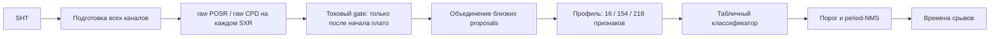

# Feature-ML: полное описание архитектуры, обучения и детектирования

Актуально на 24.09.2026.

## 0. Назначение и правило актуализации

Документ описывает фактическую реализацию feature-ML в текущем состоянии
репозитория: источники данных, псевдоразметку, генерацию кандидатов, признаки,
обучение, runtime и известные ограничения.

При каждом последующем изменении кода feature-ML этот документ должен
обновляться в том же изменении. Если меняются каналы или признаки, одновременно
обновляется и краткая сводка
[`feature-ml-channels-and-features.md`](feature-ml-channels-and-features.md).

`core/lib_info.py` является пользовательским вспомогательным файлом и не входит
в pipeline.

## 1. Что представляет собой текущий алгоритм

Feature-ML — это не нейросеть, обрабатывающая каждую точку сигнала. Это
двухступенчатый **candidate-based detector**:

1. выбранный источник (`posr`, `cpd` или `hybrid`) создаёт raw-кандидаты
   независимо на каждом доступном SXR-канале;
2. токовый gate удаляет заявки до установления тока на плато;
3. близкие оставшиеся заявки разных каналов и методов объединяются;
4. для каждого оставшегося кандидата строится вектор выбранного профиля из 16,
   154 или 218 признаков;
5. табличная модель оценивает вероятность настоящего срыва;
6. применяется порог вероятности и подавление слишком близких событий.

Событие, которое не предложил ни один генератор кандидатов, модель восстановить
не может. Поэтому итоговое качество определяется тремя уровнями:

- качеством wavelet-псевдоразметки;
- полнотой POSR/CPD proposals;
- способностью классификатора отделить срывы от ложных заявок.



Алгоритмические детекторы без МО не были переведены на эту схему и продолжают
работать через прежние entry points.

## 2. Карта реализации

| Файл | Ответственность |
|---|---|
| `main.py` | CLI, запуск обучения и детектирования |
| `config/path.py` | SXR-каналы и стандартные пути артефактов |
| `config/channels.py` | профили `reference_sxr`, `core_diagnostics`, `full` |
| `src/io/loader.py` | чтение выбранных каналов и multirate-представление |
| `src/preprocessing/alignment.py` | перенос диагностик на временную сетку SXR |
| `src/detection/utils/pipeline_utils.py` | плазменный интервал, SNR, выбор опорного SXR и подготовка данных |
| `src/detection/ml/train/manifest.py` | поиск экспертно разложенных разрядов и split по разрядам |
| `src/detection/ml/train/pseudo_labels.py` | многоканальный wavelet teacher |
| `src/detection/ml/multisxr_proposals.py` | независимые SXR proposals и их объединение |
| `src/detection/ml/train/expert_labels.py` | загрузка и строгая проверка ручной разметки |
| `src/detection/ml/annotation/backend.py` | каталог разрядов, загрузка/прореживание сигналов и автоматические подсказки для разметчика |
| `src/detection/ml/annotation/store.py` | атомарное сохранение ручной разметки и защита от одновременной перезаписи |
| `src/detection/ml/annotation/app.py` | локальный веб-интерфейс экспертной разметки |
| `src/detection/ml/train/candidate_dataset.py` | POSR/CPD-кандидаты, объединение expert + wavelet и метки `0/1/ignore` |
| `src/detection/ml/multichannel_features.py` | схемы и построение 16/154/218 признаков |
| `src/detection/utils/features.py` | 16 признаков формы опорного SXR и физические scores |
| `src/detection/ml/train/feature_classifier.py` | обучение, выбор порога, метрики, сохранение модели |
| `src/detection/ml/train/feature_ml_pipeline.py` | полный train pipeline после готовой псевдоразметки |
| `src/detection/ml/models/feature_ml_detector.py` | загрузка модели и runtime-классификация |
| `src/detection/ml_pipeline.py` | верхнеуровневый runtime feature-ML |

## 3. Входные данные и категории

`build_shot_manifest()` ищет `.SHT` в четырёх каталогах:

- `easy` — хорошо выраженные пилы;
- `medium` — пилы средней сложности;
- `hard` — сложные и шумные случаи;
- `notSaw` — разряды без пилообразных колебаний.

Другие каталоги, в том числе `random`, автоматически в обучение не входят.
Одинаковый `shot_id` не может одновременно находиться в двух категориях.

Разделение train/validation делается целыми разрядами, стратифицировано по
категории и воспроизводимо через `random_state`. Кандидаты одного разряда не
разбрасываются между train и validation.

Категория разряда сама по себе не задаёт времена срывов. Точные времена для
`easy`, `medium` и `hard` формирует wavelet teacher. Для `notSaw` все proposals
считаются отрицательными.

## 4. Подготовка одного разряда

`prepare_shot_for_detection()` выполняет общую подготовку обучения и runtime:

1. загружает ток плазмы, доступные SXR и профиль дополнительных диагностик;
2. по `Ip внутр.(Пр2ВК) (инт.18)` определяет плазменный интервал;
3. внутри него находит начало плато тока и строит токовую маску;
4. вычисляет для каждого SXR отношение стандартного отклонения в плазме к шуму
   до плазмы;
5. для ML автоматически выбирает доступный SXR с максимальным SNR;
6. отклоняет разряд, если лучший SXR не достигает `SNR = 2`;
7. вычитает среднее и robust-нормирует SXR;
8. оценивает период, `period_map` и `saw_mask`; если предварительная проверка не
   увидела пилу, ML продолжает обработку с периодом 3 ms;
9. дополнительные каналы сохраняет в исходных сетках, затем линейно переносит
   их на плазменную временную сетку опорного SXR с маской валидности.

### 4.1. Токовый gate старта плато

Старый плазменный интервал открывался уже при `Ip > 0.2 × max(Ip)`. Поэтому в
него попадал фронт тока с общими электромагнитными наводками. Такая наводка
может синхронно присутствовать на нескольких SXR, так что даже многоканальный
wavelet ошибочно подтверждает её как teacher-событие.

Теперь ток внутри плазменного интервала сглаживается окном 0.25 ms и делится на
robust-оценку плато — 95-й процентиль тока. Gate открывается, когда ток не менее
`0.8` от этой оценки в течение `0.5 ms`. До этого момента teacher и генераторы
proposals не принимают кандидаты. После открытия gate остаётся открытым до
конца плазменного интервала, поэтому поздний спад тока не отрезает настоящие
пилы. Параметры сохраняются с моделью и одинаково используются в обучении и
runtime. Gate включается только entry points feature-ML; алгоритмические
детекторы продолжают использовать прежнюю подготовку и не фильтруются по нему.

Следовательно, SXR 50 больше не является обязательным опорным каналом. Он имеет
приоритет лишь при точном равенстве качества с другим каналом, если был передан
как предпочтительный.

В feature-ML `require_sawtooth=False`: предварительный sawtooth-фильтр не должен
удалять сложные разряды до модели.

## 5. Временные сетки и индексы

В pipeline существуют три системы координат:

1. полная сетка SHT;
2. `time_plasma` после обрезки по плазменному интервалу;
3. прореженная сетка детектора с шагом `dt × downsample`.

Переход выполняется строго так:

```text
plasma_index = detector_index × downsample
absolute_time = time_plasma[plasma_index]
relative_time = absolute_time − time_plasma[0]
```

Модель хранит `downsample` и эффективный `dt`; runtime отклоняет несовместимые
настройки.

## 6. Wavelet teacher: создание обучающих времён

Teacher запускает `WaveletEnergyDetector` **независимо на каждом доступном SXR**,
для которого `SNR >= 2`. Начальный период каждого запуска равен 3 ms и не
наследуется от автоматически выбранного опорного канала.

Кандидаты разных SXR объединяются в окне 0.15 ms. Кластер не расширяется
транзитивно: его ширина ограничивается относительно первого события.

- событие подтверждено минимум двумя разными SXR — `events`, положительная
  teacher-метка;
- событие есть только на одном SXR — `uncertain_events`;
- для `notSaw` оба списка намеренно пусты.

Неопределённые события не становятся положительными, но защищают соседние
proposals от автоматической отрицательной метки. Это снижает риск научить
модель отвергать настоящий срыв, который оказался заметен лишь на одном канале.

Основные параметры `WaveletLabelConfig`:

| Параметр | Значение |
|---|---:|
| SXR-каналы | все из `SXR_CHANNELS` |
| минимальный SNR канала | 2.0 |
| подтверждающих каналов | 2 |
| окно совпадения | 0.15 ms |
| начальный период | 3 ms |
| downsample | 10 |
| wavelet | `mexh` |
| wavelet threshold | 1.0 |

Это всё ещё псевдоразметка: модель учится приближать решения teacher, а не
независимую экспертную разметку каждого события.

### 6.1. Экспертная разметка

Ручные метки хранятся отдельно в
`data/annotations/expert_events.json` (схема 2). Файл не заменяет исходный
wavelet JSON и не изменяется автоматическими этапами. Корневой формат:

```json
{
  "schema_version": 2,
  "shots": [
    {
      "shot_id": "38818",
      "relative_path": "hard/sht38818.SHT",
      "review_status": "partial",
      "shot_label": "sawtooth",
      "reviewed_intervals_s": [[0.15, 0.22]],
      "events": [
        {
          "time_s": 0.17966,
          "label": "sawtooth",
          "tolerance_s": 0.0003,
          "confidence": "certain",
          "reference_sxr": "SXR 15 мкм",
          "visible_sxr": ["SXR 15 мкм", "SXR 27 мкм"],
          "note": ""
        },
        {
          "time_s": 0.2038,
          "label": "uncertain"
        },
        {
          "time_s": 0.2112,
          "label": "false_positive",
          "source": "posr",
          "note": "периодическая наводка"
        }
      ],
      "note": ""
    }
  ]
}
```

`shot_id` разрешено задавать как `38818` или `sht38818`: при загрузке числовой
вариант нормализуется. Времена задаются в секундах на полной абсолютной шкале
SHT, а не индексами и не временем от начала плазмы.
`relative_path` служит для аудита и должен указывать тот же номер разряда;
фактический файл и принадлежность train/validation по-прежнему берутся из
готового pseudo-label split. Поэтому перенос копии в `test1` не создаёт новый
независимый разряд.

Обязательны непустые `reviewed_intervals_s`. Именно интервалы, а не
`review_status`, определяют область доверия к ручной разметке:

- внутри просмотренного интервала expert полностью заменяет wavelet;
- ручной `sawtooth` даёт положительное событие;
- рядом с ручным `uncertain` proposal исключается из обучения;
- прочие proposals в просмотренном интервале становятся надёжными
  отрицательными примерами;
- вне просмотренных интервалов продолжает действовать wavelet-разметка;
- поэтому отсутствие события в ещё не просмотренной области не превращает её
  в отрицательный пример.

`review_status = partial|complete` сохраняет состояние работы разметчика, но не
расширяет интервалы неявно. Даже для `complete` границы проверенной области
должны быть записаны явно. Каждое событие обязано лежать внутри одного из этих
интервалов. Пересекающиеся интервалы, неизвестные поля и каналы, `NaN`, неверные
времена, дублированные `shot_id` и экспертные разряды, которых нет в текущем
pseudo-label split, приводят к явной ошибке до обучения.

`reference_sxr` указывает канал, по которому удобнее всего выставлено время;
`visible_sxr` документирует остальные каналы, где виден тот же физический
срыв. Одно событие не дублируется пять раз по толщинам фольги.

`shot_label` принимает `sawtooth`, `no_sawtooth` или `uncertain`. Решение
`no_sawtooth` допустимо только после полного просмотра разряда
(`review_status = complete`) и при отсутствии положительных событий; весь
проверенный диапазон при этом должен быть записан в `reviewed_intervals_s`.
Наличие хотя бы одного ручного `sawtooth` требует `shot_label = sawtooth`.

Метка события `false_positive` означает, что автоматическая подсказка в этом
месте неверна. Для неё обязательно поле `source`: `wavelet_teacher`, `posr`,
`cpd`, `feature_ml` или `other`. Такая метка не создаёт отдельного класса
модели: внутри просмотренного интервала соответствующий proposal становится
отрицательным примером. Источник и комментарий сохраняются для аудита ошибок.

## 7. Генерация и объединение proposals

Источник задаётся параметром `--ml_proposal_source` **только при обучении**:

| Режим | Что запускается на каждом SXR |
|---|---|
| `posr` | только raw POSR |
| `cpd` | только raw CPD |
| `hybrid` | объединение raw POSR и raw CPD |

Режим по умолчанию — `posr`. Для `cpd` и `hybrid` необходим пакет `ruptures`;
его отсутствие считается явной ошибкой, а не молчаливым переходом к POSR-only.

При детектировании источник повторно не задаётся. Модель хранит выбранный
`proposal_source`, порог POSR, параметры CPD, список SXR, окно объединения,
`downsample` и минимальную дистанцию. Runtime загружает всю эту конфигурацию из
`.joblib`, поэтому невозможно случайно применить к модели другой генератор.

Режима filtered POSR в feature-ML нет. Обычный
`WaveletPOSRDetector.detect_candidates()` сохранён без изменений только для
алгоритмического детектора.

### 7.1. Как формируется raw POSR proposal

Для каждого доступного SXR отдельно:

1. сигнал берётся на прореженной сетке `signal[::downsample]`;
2. `WaveletEdgeCore` вычисляет знаковый wavelet response;
3. в зависимости от настройки направления рассматривается модуль response или
   только положительная часть;
4. `find_peaks` создаёт первичные локальные пики с технической минимальной
   дистанцией 0.15 ms;
5. для каждого пика считается POSR weight: из локального окна исключаются самые
   сильные значения, после чего отклонение пика измеряется в стандартных
   отклонениях оставшегося фона;
6. остаются пики с `POSR weight >= ml_proposal_threshold` (по умолчанию 3.0);
7. удаляются только пики в техническом краевом отступе 0.5 ms;
8. `physics_score`, направление и `jump_to_amp` вычисляются как metadata и для
   ранжирования, но не используются для отбраковки.

До ML **не применяются** sawtooth mask, `physics_score` threshold,
`jump_to_amp` threshold и period-based NMS. Первичная дистанция 0.15 ms является
частью определения локальных пиков, а не физической постфильтрацией по периоду.
Кандидат получает метод `wavelet_posr_raw`.

### 7.2. Как формируется raw CPD proposal

Для каждого доступного SXR отдельно:

1. строится CPD-представление сигнала: сглаживание, detrend и robust-признаки;
2. для `rbf`, `linear` или `cosine` запускается `ruptures.KernelCPD`, для других
   моделей — `ruptures.Pelt`;
3. берутся все внутренние breakpoints, найденные с заданным penalty;
4. для каждой точки вычисляются `physics_score` и направление только как
   metadata.

Raw CPD не использует sawtooth mask, fallback по производной, physics/jump
threshold, period-NMS и ограничение количества событий. Если `ruptures` не
установлен, CPD raw-кандидаты не создаются. Метод кандидата — `cpd_raw`.

### 7.3. Объединение каналов и методов

Все raw-заявки выбранного режима сортируются по времени. Заявки, попавшие в
окно 0.15 ms относительно первого элемента кластера, превращаются в один
кандидат. Привязка к первому элементу не позволяет кластеру транзитивно
растянуться через несколько соседних срывов.

Представителем выбирается заявка опорного SXR, если она есть; иначе заявка с
максимальным score. В metadata объединённого кандидата сохраняются:

- `source_channels` — различные поддержавшие SXR;
- `source_methods` — присутствующие методы;
- `source_channel_methods` — методы отдельно по каждому SXR;
- `source_scores` — scores исходных заявок;
- `source_count` и `proposal_count`;
- `time_spread_s` — ширина кластера.

Это не обязательное голосование: single-channel и single-method кандидат также
доходит до модели. Совпадение источников становится частью признаков. Только
runtime-флаг `--multichannel` требует минимум `--min_channels` поддержавших SXR
уже после ML-классификации.

## 8. Разметка proposals

Для sawtooth-разрядов proposal сопоставляется с ближайшим подтверждённым
teacher-событием:

| Условие | Решение |
|---|---|
| расстояние не больше 0.3 ms | `label = 1` |
| расстояние от 0.3 до 0.6 ms | `ignore` |
| рядом есть single-channel `uncertain_event` | `ignore` |
| расстояние не меньше 0.6 ms | `label = 0` |

В `notSaw` каждый proposal получает `label = 0`. Sawtooth-разряд без
подтверждённых teacher events пропускается, а не превращается целиком в
отрицательный.

`proposal_recall` измеряет долю teacher-событий, рядом с которыми вообще был
хотя бы один POSR/CPD proposal. Это верхняя граница полноты последующей модели.

Если разряд присутствует в expert JSON, правила выше применяются только вне
его просмотренных интервалов. Внутри них действует экспертная разметка из
раздела 6.1. Каждая сохранённая строка кандидата содержит `label_source`:
`expert` или `wavelet`; источник также попадает в NPZ и отчёт метрик для аудита.

Для каждого ручного `sawtooth` сначала отдельно проверяется, существовал ли
рядом **сырой** proposal. По этим данным считаются:

- `expert_event_count`;
- `matched_expert_event_count`;
- `expert_proposal_recall`.

Эта метрика вычисляется до любых искусственных добавлений. Если raw POSR/CPD
пропустил ручное событие, в обучающий набор добавляется кандидат точно в
экспертном времени, выровненный на сетку `downsample`. Он получает
`method = expert_manual_injection`, `label = 1`, `label_source = expert` и
`metadata.expert_injected = true`. Так классификатор видит форму пропущенного
срыва, но сам факт добавления не повышает `expert_proposal_recall`.
Чтобы не создать утечку целевого класса через невозможные в runtime нулевые
proposal-признаки, инъекция получает синтетическое минимальное evidence одного
источника на `reference_sxr` (либо на опорном SXR). Служебный
`expert_injected` в карту признаков не входит.

Принудительный кандидат существует только при обучении. Если низкий
`expert_proposal_recall` подтвердится на ручной разметке, runtime-генератор надо
будет расширять отдельно: классификатор не может восстановить событие, которое
ему не предложили при детектировании.

## 9. Признаки

`MultichannelFeatureBuilder` поддерживает три карты признаков:

| Профиль | Состав | Размер |
|---|---|---:|
| `reference_sxr` | только локальная форма автоматически выбранного SXR | 16 |
| `core_diagnostics` | опорный и все SXR, proposals, токи, D-alpha, МГД | 154 |
| `full` | все доступные блоки ниже | 218 |

Полный профиль `full` строит:

| Блок | Размер |
|---|---:|
| форма автоматически выбранного опорного SXR | 16 |
| 11 признаков для каждого из 5 SXR | 55 |
| 6 признаков для каждого из 19 диагностических каналов | 114 |
| 4 агрегата для каждой из 7 групп диагностик | 28 |
| свойства объединённого proposal | 5 |
| **Итого** | **218** |

Полные таблицы каналов, формул и имён столбцов приведены в
[`feature-ml-channels-and-features.md`](feature-ml-channels-and-features.md).

Для многоканальных признаков используется симметричное окно
`clip(0.25 × period, 0.2 ms, 1 ms)`. Каждый канал robust-нормируется по своему
плазменному интервалу. Отсутствие и неполное покрытие канала явно кодируются.

Текущий профиль содержит два тока плазмы, пять D-alpha, четыре МГД,
`Plasma shift`, пять напряжений, радиометр 8 mm и диамагнитный сигнал.

Схема признаков имеет внутреннюю версию 5, модель — внутреннюю версию 7,
псевдоразметка — 3, экспертная разметка — 2, candidate dataset — 8. Эти
числа находятся внутри артефактов для проверки совместимости и не включаются в
имена файлов.

Runtime проверяет полный порядок схемы, профиль каналов, downsample,
эффективный `dt` и настройки proposals. Несовместимую модель нужно переобучить.

## 10. Модель и обучение

Стандартный backend — `sklearn_hgb` (`HistGradientBoostingClassifier`) с
балансировкой классов. Также поддерживаются CatBoost и XGBoost, если они
установлены и явно выбраны.

Порог вероятности выбирается по максимуму F1 на validation. При равном F1
предпочитается больший recall, затем порог, ближайший к 0.5. Сохранённый порог
используется runtime, если пользователь не передал другой.

После классификации применяется period-NMS с минимальной дистанцией
`0.45 × period`.

Важно: validation состоит из других разрядов, но размечена тем же wavelet
teacher. Высокая validation-метрика показывает способность повторять teacher на
отложенных разрядах, а не гарантирует экспертное качество на сложных пилах.

## 11. Runtime

Для нового разряда выполняется та же подготовка каналов, токовый gate,
автоматический выбор опорного SXR и построение карты признаков, сохранённой в
модели. Затем создаются и объединяются
proposals, модель вычисляет вероятность, применяется порог, опциональное
требование числа SXR и period-NMS, после чего индексы переводятся во времена.

Без `--multichannel` single-channel proposal разрешён. Какие сигналы затем
видит модель, определяется сохранённым профилем признаков.

## 12. Артефакты и пути

Стандартные пути определены только в `config/path.py`:

| Артефакт | Путь |
|---|---|
| teacher-разметка | `data/dataset/wavelet_pseudo_labels.json` |
| ручная экспертная разметка | `data/annotations/expert_events.json` |
| размеченные proposals | `data/dataset/feature_ml_candidates_<source>.json` |
| матрицы признаков | `data/dataset/feature_candidates_<source>_<profile>.npz` |
| модель | `data/model_data/feature_ml_<source>_<model>_<profile>.joblib` |
| отчёт | `data/model_data/feature_ml_metrics_<source>_<model>_<profile>.json` |

`<source>` равен `posr`, `cpd` или `hybrid`, а `<model>` — фактически
использованному backend: `sklearn_hgb`, `catboost` или `xgboost`, а `<profile>`
равен `reference_sxr`, `core_diagnostics` или `full`. Например, обучение POSR +
CatBoost + core записывает `feature_ml_posr_catboost_core_diagnostics.joblib` и
не затрагивает другие модели. Если выбран backend `auto`, в имя
попадает не слово `auto`, а реально выбранная библиотека.
Teacher-разметка имеет единое имя, потому что от генератора proposals не
зависит. Особое имя любого выходного файла можно передать внешним параметром
CLI.

## 13. Запуск

### 13.1. Веб-интерфейс ручной разметки

Зависимости интерфейса вынесены отдельно, чтобы обязательная часть детектора не
зависела от веб-фреймворка:

```bash
.venv/bin/pip install -r requirements-ui.txt
MPLCONFIGDIR=/tmp/mpl .venv/bin/streamlit run \
  src/detection/ml/annotation/app.py
```

После запуска интерфейс доступен по адресу `http://localhost:8501`. Для работы
на сервере можно добавить `--server.address 0.0.0.0 --server.port 8501`.
Сам Streamlit не является контуром аутентификации: при доступе извне приложение
следует закрыть VPN или reverse proxy с авторизацией.

Streamlit обычно печатает две ссылки. `Local URL` открывает приложение только
на том же компьютере. `Network URL` содержит локальный IP компьютера и позволяет
открыть тот же процесс с другого устройства в доступной локальной сети, если
этому не мешают firewall и настройки сети. Это не означает автоматическую
публикацию приложения в интернете.

Рабочий порядок в интерфейсе:

1. Выбрать категорию и разряд. Каталог строится из канонического pseudo-label
   split, поэтому копии из `test1`/`random` не становятся новыми разрядами.
2. Выбрать любые доступные каналы SHT. По умолчанию показываются SXR и ток
   плазмы; каналы с разными временными сетками рисуются по своим временам.
3. При необходимости вычислить подсказки raw POSR, raw CPD и текущей
   feature-ML модели. Wavelet teacher из pseudo-label JSON показывается сразу.
4. Щёлкнуть по сигналу или ввести время числом, выставить `sawtooth` либо
   `uncertain`, опорный SXR, видимые SXR, допуск, уверенность и комментарий.
5. Для неверной автоматической подсказки выбрать её источник и создать
   `false_positive`. Для просмотренной области добавить интервал; около ручной
   событийной метки небольшой интервал добавляется автоматически.
6. Для разряда без пил нажать отдельную кнопку и подтвердить решение. UI
   выставит `complete + no_sawtooth`, запишет весь показанный диапазон как
   просмотренный и удалит противоречащие ручные `sawtooth`/`uncertain`, оставив
   историю отклонённых автоматических подсказок.
7. Нажать сохранение. Перед записью проверяются все обязательные поля и полная
   схема. Запись атомарная; если файл успел изменить другой процесс, UI не
   перезапишет его молча и попросит перечитать данные.

График сохраняет экстремумы при прореживании, поэтому узкий пик не исчезает
только из-за визуального downsampling. Ручные времена не обязаны совпадать с
POSR/CPD/wavelet: это позволяет добавить пропущенный реальный срыв независимо
от качества автоматических генераторов.

### 13.2. Разметка, обучение и детектирование из CLI

Из корня репозитория:

```bash
.venv/bin/python -m src.detection.ml.train.pseudo_labels --source-dir data/raw
.venv/bin/python main.py --mode train --method feature_ml \
  --ml_proposal_source posr \
  --ml_feature_profile reference_sxr \
  --expert_labels_path data/annotations/expert_events.json
.venv/bin/python main.py --mode train --method feature_ml \
  --ml_proposal_source posr \
  --ml_feature_profile core_diagnostics
.venv/bin/python main.py --mode train --method feature_ml \
  --ml_proposal_source posr \
  --ml_feature_profile full
```

Первая команда создаёт псевдоразметку, следующие — candidates, признаки,
модели и метрики. Стандартный expert JSON подхватывается и без явного параметра;
параметр показан для документирования входа. Обучение не перегенерирует ни
teacher-разметку, ни экспертный файл.

Пример детектирования:

```bash
.venv/bin/python main.py \
  --mode detect \
  --method feature_ml \
  --source_dir data/raw \
  --file hard/sht44335.SHT
```

Без `--model_path` загружается
`feature_ml_posr_sklearn_hgb_full.joblib`. Для другой
ветки эксперимента достаточно выбрать её модель, например
`--model_path data/model_data/feature_ml_cpd_catboost_core_diagnostics.joblib`:
отдельно
указывать CPD или CatBoost в режиме детектирования не нужно. Порог классификации
можно временно переопределить через `--probability_threshold`; конфигурация
proposals при этом остаётся модельной.

`main.py` без аргументов исполняет ручной демонстрационный блок в конце файла и
не является командой обучения.

## 14. Последний сохранённый baseline до raw-POSR рефакторинга

Приведённые ниже числа относятся к предыдущему артефакту с filtered POSR + raw
CPD. После перехода на выбираемые raw-источники старые candidate dataset и
модель несовместимы с текущей схемой и должны быть перестроены. Новые метрики
нужно внести сюда после переобучения.

| Показатель | Train | Validation |
|---|---:|---:|
| разряды | 42 | 11 |
| easy | 17 | 4 |
| medium | 14 | 4 |
| hard | 9 | 2 |
| notSaw | 2 | 1 |
| кандидаты | 4 068 | 1 015 |
| положительные кандидаты | 1 299 | 246 |
| подтверждённые teacher events | 1 173 | 232 |

Модель использует 218 признаков. На validation при сохранённом пороге 0.56
отчёт показывает:

- общий F1: 0.949;
- общий candidate recall: 0.947;
- teacher-event recall: 0.892;
- proposal recall до классификатора для `hard`: 0.879;
- для `hard`: candidate recall 0.889, но teacher-event recall 0.759;
- для `hard` в validation имеются всего два разряда.

Эти числа согласуются с наблюдением, что easy/medium работают лучше hard, но не
заменяют визуальную экспертную проверку. Особенно важно, что threshold выбран
на том же validation, по которому приведены метрики.

### 14.1. Технический прогон нового raw-POSR

После рефакторинга выполнено полное обучение в режиме `posr` во временные файлы,
без перезаписи рабочих артефактов. Оно подтвердило связность pipeline:

| Показатель | Train | Validation |
|---|---:|---:|
| кандидаты raw POSR | 8 956 | 2 450 |
| proposal recall, все sawtooth-категории | 99.7% | 100% |
| proposal recall, `hard` | 99.2% | 100% |

На этом техническом прогоне validation F1 равен 0.928, общий teacher-event
recall — 0.918, а teacher-event recall для `hard` — 0.879. Эти метрики нельзя
считать окончательной оценкой качества: threshold выбран на том же validation,
`hard` содержит только два разряда, а рабочая модель ещё не перезаписана.
Главный ожидаемый результат достигнут: raw POSR почти не теряет teacher-события
до классификатора и передаёт модели существенно больше отрицательных примеров.

## 15. Достаточность 218 признаков

Да, для текущего размера датасета признаков может быть многовато.

Соотношение 4 068 строк к 218 столбцам само по себе выглядит приемлемо, но
строки внутри одного разряда зависимы. Эффективно модель видит только 42
обучающих эксперимента, из них 9 `hard` и 2 `notSaw`. Дополнительно:

- признаки одного физического скачка сильно коррелированы;
- групповые агрегаты частично повторяют поканальные признаки;
- SXR 27 присутствует примерно в 12.6% строк, `U PF3` имеет среднее покрытие
  около 36.8%;
- модель может использовать наличие канала как признак серии экспериментов;
- teacher и классификатор используют связанные SXR-наблюдения.

Древовидная модель умеет игнорировать часть бесполезных столбцов, но это не
устраняет риск нестабильных зависимостей при малом числе разрядов.

## 16. Эксперимент с профилями и следующий этап

Три профиля групповой абляции уже реализованы. На одном техническом split после
введения токового gate получены следующие validation-результаты для raw POSR и
`sklearn_hgb`:

| Профиль | F1 | Candidate recall | Specificity | Teacher-event recall |
|---|---:|---:|---:|---:|
| `reference_sxr` | 0.918 | 0.918 | 0.951 | 0.920 |
| `core_diagnostics` | 0.911 | 0.893 | 0.960 | 0.900 |
| `full` | 0.918 | 0.905 | 0.961 | 0.908 |

Различия малы, а `reference_sxr` не хуже полного профиля по F1 и лучше по
recall. Это подтверждает риск лишних признаков, но один split и wavelet-метки не
заменяют экспертную проверку.

Следующим этапом должен быть эксперимент с несколькими split по целым разрядам.
Сначала нужно отделить ошибки teacher, proposals и классификатора: уменьшение
числа признаков исправляет только последний уровень.

Предлагаемый порядок:

1. Зафиксировать набор экспертно выбранных `hard`-разрядов для финальной ручной
   проверки и не использовать их при выборе конфигурации.
2. Для каждого пропущенного экспертного события фиксировать стадию потери:
   отсутствует teacher-метка, нет POSR/CPD proposal, proposal отклонён моделью
   или событие удалено NMS.
3. Для каждого реализованного профиля провести несколько split по `shot_id`,
   не по кандидатам.
4. Сравнивать F1 кандидатов, proposal recall, teacher-event recall, ложные
   срабатывания на разряд и результаты отдельно на `hard`/`notSaw`.
5. Выбрать минимальный набор, который устойчиво не ухудшает hard recall и
   уменьшает ложные срабатывания.
6. Показать худшие hard-разряды эксперту и только затем зафиксировать профиль.

Этот эксперимент ответит на вопрос о лишних признаках данными. Простого
ранжирования importance недостаточно: коррелированные признаки делят важность,
а один validation split сейчас слишком мал.

Исторический hard proposal recall 0.879 показывал, что часть teacher-событий
теряется до модели. Если экспертное событие отсутствует среди POSR/CPD
proposals, изменение классификатора и признаков его не исправит.

## 17. Известные ограничения

1. Ручной интерфейс реализован, но временные ground-truth метки ещё не набраны
   в достаточном количестве.
2. Нет отдельного независимого test split.
3. Слишком мало `hard` и особенно `notSaw` разрядов.
4. Порог подобран на текущем validation и может быть оптимистичным.
5. ML не может найти событие, отсутствующее среди proposals.
6. Выбор SXR по простому SNR не гарантирует наиболее чистую пилу.
7. Требование двух SXR для teacher может пропустить событие, видимое на одном.
8. Наличие редких каналов может кодировать серию экспериментов.
9. Категории `easy/medium/hard` задают split и отчёт, но не времена событий.

## 18. Инварианты разработки

- Нельзя менять порядок или формулу признаков без повышения внутренней схемы и
  полного переобучения.
- Train и runtime обязаны использовать один `MultichannelFeatureBuilder`.
- Split выполняется только по целым разрядам.
- Отсутствие teacher events в sawtooth-разряде не означает отрицательный класс.
- Single-channel uncertain event не используется как отрицательная окрестность.
- Параметры proposals, downsample и effective `dt` должны совпадать.
- Пути по умолчанию хранятся в `config/path.py`.
- Изменение feature-ML кода сопровождается обновлением этого документа; изменение
  каналов/признаков также обновляет краткую сводку.

## 19. Тестовые гарантии

Тесты проверяют выравнивание multirate-каналов, фиксированную размерность и
порядок признаков, отсутствующие каналы, многоканальный teacher, SNR-фильтр,
uncertain/false-positive events, правила `no_sawtooth`, атомарную запись с
защитой от конфликтов, прореживание графика с сохранением экстремумов,
совместимость train/runtime, отклонение несовместимой модели и стабильные пути
артефактов. Дополнительно выполнен smoke-test Streamlit на реальном SHT.

Канонический запуск:

```bash
.venv/bin/python -m unittest discover -s tests -t . -q
```
